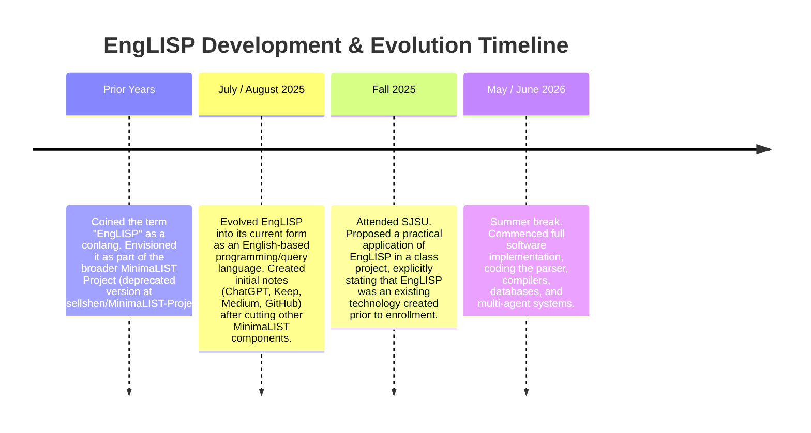

# EngLISP Project Provenance & Attribution Record

This document serves as a formal record of the conceptualization, design, development, and intellectual property history of the **EngLISP** project. It outlines the timeline, repository evidence, and paper trail supporting the sole ownership and authorship of Russell Shen.

---

## 📅 Chronological Timeline

### 1. Conceptualization Phase (Pre-University)
* **Origins**: The term **EngLISP** was coined several years ago by Russell Shen. It was originally defined as a conlang using Lisp syntactic structure and English root vocabulary.
* **MinimaLIST Project (Pre-2025)**: EngLISP was initially envisioned as a sub-component of a larger, now-deprecated project called **MinimaLIST** (hosted at [russellshen/MinimaLIST-Project](https://github.com/russellshen/MinimaLIST-Project)). After evaluating the project's direction, the other components of the MinimaLIST project were cut, and focus was redirected exclusively onto EngLISP as the most viable, high-potential, and marketable part of the technology.
* **Evolution (July / August 2025)**: The concept evolved into its current state—a bridge language for natural-like, structured programming and database query representation—prior to attending San Jose State University (SJSU).
* **Early Records**: Conceptual thoughts, design ideas, and drafts were recorded across multiple external platforms, including:
  * ChatGPT history
  * Google Keep notes
  * Medium posts/drafts
  * Public/private GitHub repositories and gists

### 2. Academic Project Context (Fall 2025)
* **SJSU Course Project**: During the Fall 2025 semester, EngLISP was referenced in a team project.
* **Scope & Terms**: The team project was explicitly scoped as a **proposal for a single practical application** of an *already existing* technology.
* **Attribution**: It was clearly documented that Russell Shen was the sole inventor of EngLISP and that the technology itself was created prior to attending the university. No university resources or funding were utilized to develop or implement the core engine of EngLISP.

### 3. Implementation Phase (May – June 2026)
* **Timing**: The full-scale implementation, design of the compiler, multi-agent sandbox, and web interface took place during the summer break of 2026 (outside of university terms and academic coursework).
* **Development Environment**: Developed entirely on personal hardware, without the use of university labs, servers, software licenses, or academic supervision.

---

## 💻 Repository Evidence (Git Log)

The git repository for the EngLISP project contains a clear commit history verifying the exact dates of the active codebase construction.

### Initial Commit Details
* **Commit Hash**: `562a56bd58dbc47c2943ef5c0d2e9c3b78810394`
* **Author**: Russell Shen (<russellshen7@gmail.com>)
* **Date**: `Mon Jun 1 23:09:05 2026 -0700`
* **Message**: `Initial commit with public EngLISP bridge and fallback sample resources`

### Key Early Milestones
1. **June 1, 2026** (`562a56b`): Initial repository structure and EngLISP bridge definition.
2. **June 22, 2026** (`0688178` - `947b47f`): Structural refinement and comment header synchronization.
3. **June 24, 2026** (`d86880a` - `226ae22`): Core database compilers, multi-agent sandbox UI, voice-enabled parsing, and Clojure target integration.
4. **June 27, 2026** (`3bfd707`): Scoping fixes, rate limiting, and interface stabilization.

---

## 🔒 Supporting Paper Trail Elements

To verify sole authorship and defend against potential claims from academic institutions or third parties, the following records are maintained:

1. **AI Conversation Logs**: Complete transcript records from the Antigravity system, capturing every coding session, logic decision, and incremental change in detail.
2. **External Timestamped Drafts**:
   * Google Keep notes with creation metadata from July/August 2025.
   * ChatGPT transcripts showing the original prompt engineering and grammar specifications.
   * Medium draft history and published articles showing the evolution of the concept.
   * Deprecated repository: [russellshen/MinimaLIST-Project](https://github.com/russellshen/MinimaLIST-Project).
3. **Class Project Handouts / Presentations (Fall 2025)**: Documents submitted to SJSU that explicitly define EngLISP as a pre-existing technology being utilized for a hypothetical application proposal, establishing that the school project did not invent or fund EngLISP.

> [!NOTE]
> Under typical university IP policies (such as those at SJSU), the university only claims rights to intellectual property that is created:
> 1. With significant use of university resources (facilities, funds, equipment).
> 2. As part of a student's employment by the university.
> 3. Under a specific sponsored research agreement.
>
> Pre-existing IP, or IP created entirely on personal time using personal resources during breaks, remains the sole property of the creator.

---

## License, Copyright, & Feedback

Copyright © 2026 Russell Shen. All rights reserved.

This project and its documentation are licensed under the **Creative Commons Attribution-NonCommercial-NoDerivatives 4.0 International (CC BY-NC-ND 4.0)** license.

### License Clarification & Terms

Under the CC BY-NC-ND 4.0 license, you are free to download, copy, and share this codebase for personal, academic, or non-commercial study, subject to the following strict conditions:

1. **Attribution (BY)**: You must give appropriate credit to the author (**Russell Shen**), provide a link to this license, and indicate if any modifications were made. You must do so in a reasonable manner, but not in any way that suggests endorsement.
2. **Non-Commercial (NC)**: You may not use the material for commercial purposes. This explicitly prohibits using this software, its algorithms, data files, or documentation in any commercial products, revenue-generating activities, paid API services, or closed-source corporate projects.
3. **No Derivatives (ND)**: If you remix, transform, or build upon this material, you are permitted to do so only for private, personal use. You **may not distribute** any modified or derived versions of the code, specifications, or datasets to the public or any third party.

### Support & Sponsorship

If you find the EngLISP project useful and want to support its ongoing development, optimization, and research, please consider sponsoring:

* **GitHub Sponsors**: [Sponsor Russell Shen on GitHub](https://github.com/sponsors/russellshen)

Your support helps maintain the public code, keep the hosted playground running, and fund future multi-lingual expansions.

### Questions, Suggestions, & Feedback

If you have honest, good-faith questions, suggestions, or ideas about the EngLISP project or the LSON specification, please feel free to reach out. I welcome community feedback, academic inquiries, and theoretical discussions.

### Commercial Licensing & Contact

Any use outside the narrow scope of the CC BY-NC-ND 4.0 license is strictly prohibited without a separate commercial agreement. Parties interested in commercial deployment, proprietary closed-source integration, SaaS hosting, or distributing modified versions, or who have general feedback and inquiries, may contact the author directly:

* **Russell Shen**
* 📧 [russellshen7@gmail.com](mailto:russellshen7@gmail.com)

*Licensing terms, scope, and compensation are subject to separate negotiation and are granted only by explicit written agreement.*
