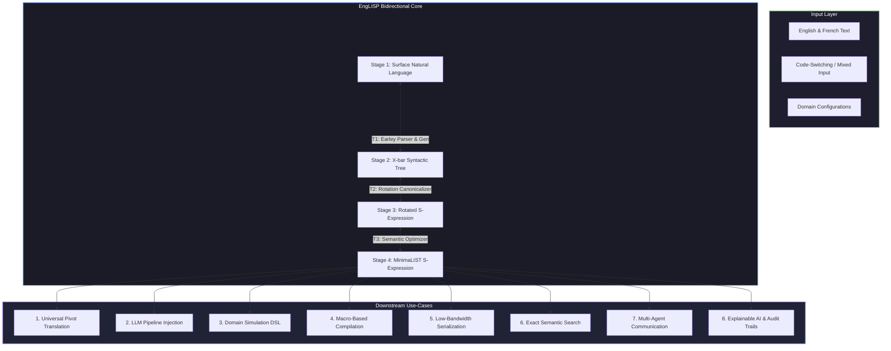

# EngLISP Use-Cases & Applications


EngLISP is a structured, bidirectional bridge that resolves the fundamental divide between the expressive, ambiguous world of human language and the precise, executable world of computation. By modeling natural language syntax as hierarchical X-bar structures, rotating them into canonical S-expressions, and applying semantic minimization, EngLISP creates a language-neutral, zero-redundancy interlingua.

This document presents a comprehensive analysis of the potential use-cases for EngLISP, targeting the general public, business stakeholders, and academic specialists.

---

## High-Level Architecture & Flow

The following diagram illustrates how diverse inputs (from multi-lingual texts to structured domain configurations) flow through the four-stage EngLISP pipeline to power various applications:



---

## 1. Core Use-Cases

These three core use-cases demonstrate the foundational capabilities of the EngLISP system.

### A. EngLISP as a Neutral Universal Pivot Language
In multilingual machine translation, translating between $N$ languages traditionally requires $N \times (N-1)$ translation pairs or a shared, complex dense embedding space. EngLISP offers a discrete, symbolic alternative.

*   **How it Works**: By mapping surface grammatical terminals from different languages (such as English and French) to language-neutral **BabelNet Synset IDs** (e.g., `s00008064n` for "bank") in Stage 3 and 4, EngLISP acts as a universal intermediate representation (IR). 
*   **The Academic Appeal**: Validates the hypothesis of a universal generative grammar (Noam Chomsky's Universal Grammar) by demonstrating that distinct syntactic layouts (like French adjective positioning or English word order) can be rotated and normalized into identical S-expressions.
*   **The Commercial Appeal**: Companies only need to build a single bidirectional interface ($1$ parser and $1$ generator) between their native language and EngLISP. Adding a new language instantly enables translation to and from all other supported languages in the ecosystem, dramatically reducing localization costs.
*   **References**: Read more in [LEXICAL_STRATEGIES.md#1-scale-level-lexical-datasets--word-signatures](LEXICAL_STRATEGIES.md#L9-L16).

### B. LLM Pipeline Injection (Hallucination Reduction & Semantic Clarity)
Modern Large Language Models (LLMs) process text as a sequence of tokens, which makes them prone to syntactic confusion, reasoning shortcuts, and factual hallucinations. 

EngLISP's originally envisioned use-case is a complete, 3-action pipeline designed to force LLMs to operate on pure semantics without syntactic ambiguities or misreadings:
1.  **Semantic Pre-Training**: Convert all LLM training data (web corpora, books, code, etc.) into EngLISP beforehand. The LLM is then pre-trained and fine-tuned natively on EngLISP S-expressions instead of raw natural language, teaching the model to represent and reason about knowledge using mathematically structured, invariant semantic constructs.
2.  **On-the-Fly Prompt Parsing**: When a user enters a natural language prompt, the system intercepts the text and parses it on the fly into an EngLISP S-expression before inserting it into the LLM pipeline, eliminating any structural or lexical ambiguity.
3.  **Bidirectional Output Generation**: When the LLM responds (producing clean EngLISP S-expressions), the system either converts the EngLISP response back into the user's preferred natural language, or spits out the raw EngLISP directly if the user prefers.

*   **The Academic Appeal**: Establishes a hybrid neuro-symbolic pipeline. It separates the **syntactic structural parsing** (handled deterministically by the Earley Chart Parser) from the **semantic generation** (handled by the LLM), ensuring that syntactic parsing errors do not pollute the LLM's reasoning space.
*   **The Commercial Appeal**: Drastically reduces hallucination rates in enterprise AI applications by forcing logical rigor. Furthermore, it compresses prompt lengths (by stripping redundant determiners and compiling idioms), saving substantial API token costs.
*   **References**: See the pipeline transformations in [SPECIFICATION.md#1-overview--core-philosophy](SPECIFICATION.md#L7-L17).


### C. Domain Modeling Language for Structured Simulations
Developing computer simulations (e.g., physics, logistics, agent-based behavior) usually requires writing raw code, which domain experts (doctors, military strategists, economists) cannot easily review or write.

*   **How it Works**: EngLISP serves as a human-readable Domain Specific Language (DSL). Domain experts write rules or scenarios in natural language. The system converts these into Stage 4 MinimaLIST S-expressions, which are compiled or interpreted directly by the simulation engine.
*   **The Academic Appeal**: Bridges natural language semantics with formal action languages and temporal logics, allowing natural sentences to be mapped directly to state-transition systems.
*   **The Commercial Appeal**: Subject-matter experts can write, edit, and audit complex simulation parameters using clear natural language sentences, while the simulation engine executes them with the safety and speed of a formal abstract syntax tree.
*   **References**: For details on the interpreter execution, see [minimizer.py](englisp/minimizer.py).

---

## 2. Extended Use-Cases

These use-cases extend EngLISP's capabilities into software engineering, security, databases, and semantic data exchange.

### D. Compile-Time Natural Language Programming (Lisp Macros)
Traditional "natural language programming" systems rely on complex interpreters or neural code generators that write buggy code. EngLISP compiles natural language directly using native Lisp macros.

*   **Description**: Because Stage 4 MinimaLIST S-expressions are valid Lisp ASTs, they integrate natively with Lisp's **homoiconic** design. By loading EngLISP expressions directly into a Lisp compiler (like Common Lisp or Clojure), developer-defined macros expand the linguistic structures into high-performance, compiled binary code at compile-time.
*   **Target Audience**: Academic specialists in programming language theory (PLT) and software engineers looking for mathematically sound, zero-overhead natural language code execution.
*   **Example**: Compiles the prompt *"The dog can chase the cat"* directly into a high-performance binary capability check:
    ```lisp
    ;; EngLISP Input
    (can (chase dog cat))
    
    ;; Compiled Machine Code (after Macro Expansion)
    (if (has-ability-p 'chase dog)
        (execute-simulation-chase dog cat)
        (error "Capability check failed"))
    ```
*   **References**: Read [SPECIFICATION.md#11-native-lisp-compilability--meta-programming](SPECIFICATION.md#L168-L203).

### E. Zero-Redundancy Semantic Serialization & LSON Data Format
When transmitting data over bandwidth-constrained networks (e.g., satellite communications, IoT edge sensors, deep-space telemetry), standard text or JSON payloads are highly redundant and structurally limited. 

EngLISP addresses this by leveraging **LSON** (**Lisp Symbolic Object Notation**)—a data representation format that is theoretically superior to JSON in several key respects:
1.  **Boilerplate Elimination**: LSON strips away commas, colons, and massive double-quote redundancies, yielding a significantly smaller byte footprint over the wire than JSON.
2.  **Native Graph Sharing & Circular References**: JSON cannot serialize data models containing circular relationships or shared node hierarchies without manual tracking keys. LSON uses Lisp's standard anchor `#N=` and backreference `#N#` syntax to represent complex directed acyclic graphs (DAGs) and networks natively.
3.  **Homoiconicity (Data-Code Duality)**: While JSON is strictly passive data, LSON is valid Lisp. It represents both data structures and executable abstract syntax trees (ASTs) simultaneously, enabling immediate compile-time macro expansion and execution.
4.  **Kolmogorov Complexity Optimization**: MinimaLIST EngLISP optimizes LSON payloads toward their Kolmogorov complexity limit by stripping default determiners, applying double-negation elimination, and performing conceptual prime contractions.

*   **Target Audience**: Systems architects, database developers, and IoT engineers who require ultra-low payload sizes, native network graph serialization, and human-readability.
*   **Comparison Example**:
    *   *JSON (232 bytes)*:
        ```json
        {"query": {"operator": "and", "statements": [{"rel": "chased", "sub": {"id": "dog_1", "type": "dog", "attrs": ["quick"]}, "obj": "cat"}, {"rel": "barked", "sub": {"id": "dog_1", "type": "dog", "attrs": ["quick"]}}]}}
        ```
    *   *LSON (74 bytes - 68% size reduction)*:
        ```lisp
        (and (chased #1={:type dog :attrs [quick]} cat) (barked #1#))
        ```
*   **References**: See optimization rules in [SPECIFICATION.md#71-forward-direction-minimization-englisp--minimalist](SPECIFICATION.md#L97-L110).


### F. Exact-Match Semantic Database Indexing & Search
Traditional search engines rely on noisy keyword matching or expensive vector search databases, which suffer from "false positives" and fail to capture precise syntactic negation or structural roles.

*   **Description**: Since EngLISP normalizes different surface structures into a single representation-invariant form, it is ideal for database indexing. Sentences like *"A cat was chased by the fast hound"* and *"The quick dog chased a cat"* map to the exact same Stage 4 S-expression: `(chase (dog quick) cat)`.
*   **Target Audience**: Database architects and enterprise search providers.
*   **Advantages**:
    1.  **Zero False Positives**: Matches only when the exact structural relationship (Agent-Action-Patient) is satisfied.
    2.  **No Vector Drift**: Does not suffer from the semantic drift common in vector search.
    3.  **Low Storage**: Indexes compressed S-expressions rather than high-dimensional floating-point vectors.

### G. Verifiable Multi-Agent Communication Protocols
In multi-agent systems, agents must communicate plans, request resources, and negotiate. Natural language is too loose and leads to misunderstandings, while rigid APIs limit agent flexibility.

*   **Description**: EngLISP provides a structured, formal, yet highly expressive communication protocol. Because EngLISP S-expressions map directly to Lambda Calculus and first-order logic, agent messages can be dynamically checked for safety, consistency, and alignment before execution.
*   **Target Audience**: Multi-agent systems (MAS) researchers and autonomous vehicle network architects.
*   **References**: Grounded in theoretical foundations described in [SPECIFICATION.md#12-computational-theory-grounding](SPECIFICATION.md#L206-L217).

### H. Explainable AI (XAI) & Human-Readable Audit Trails
Regulatory frameworks (e.g., EU AI Act) require automated decision-making systems to provide clear, understandable explanations of their actions.

*   **Description**: Instead of letting an LLM generate unexplained actions directly, the agent's internal reasoning loop must write its logical decisions in EngLISP S-expressions. The system then automatically translates these S-expressions back to natural language.
*   **Target Audience**: AI safety researchers, legal auditors, and compliance officers.
*   **Advantages**:
    -   **Mathematically Sound**: The audit trail represents the exact, executable AST used by the system.
    -   **Verifiable**: Decisions can be formally parsed and checked by automated rules.
    -   **Human Readable**: Converts instantly to readable text, ensuring that laypersons can audit machine decisions.

### I. Self-Bootstrapping Agentic AI Platforms (Antigravity Integration)
The deployment of autonomous software-coding agents (such as the Antigravity platform) requires agents to manage extensive context windows, communicate with subagents, write verifiable code edits, and retain historical reasoning logs. Current LLM-based architectures face bottlenecks in token consumption, plan hallucinations, and translation drift.

Integrating EngLISP and LSON directly into agentic AI frameworks solves these challenges recursively:
*   **Context Compaction & Token Economy**: Conversations, system prompts, and tool output histories are translated into Stage 4 MinimaLIST LSON. By stripping syntactic redundancies and mapping repeated symbols, file paths, and operations to Graph-Shared backreferences (`#1=...` / `#1#`), context window payloads are compressed by **60% to 80%** without loss of semantic information. When needed, the logs expand back to natural language on-the-fly.
*   **Homoiconic Inter-Agent Protocols**: Multi-agent setups (e.g., spawning research or coding subagents) communicate using LSON. Instructing a subagent with `(research (find-files "server.py") (grep "detect_language"))` is parsed as a formal code AST, eliminating translation drift and ambiguous instructions.
*   **Static Plan Verification & Execution Safety**: Before executing shell commands or code changes, the agent compiles its proposed operations into an EngLISP S-expression. The platform runs a local Lisp macro-expander to statically analyze the S-expression for safety (e.g. workspace boundaries) and logical correctness. This separates the **creative reasoning** (LLM) from the **syntactic execution** (symbolic compiler), eliminating command execution errors.
*   **Representation-Invariant Context Retrieval**: Codebases and files are indexed as invariant MinimaLIST S-expressions. The agent runs exact semantic queries (e.g., searching for `(find (cause (become (not alive))) ?x)` returns references to "delete", "destroy", "kill", "terminate", or "stop" operations) without relying on fuzzy vector embeddings or keyword search.

*   **Target Audience**: Agentic AI researchers, LLM platform developers, and system architects.
*   **Advantages**:
    -   **Multi-Lingual Dev Collaboration**: Non-English-speaking developers can prompt the agent in their native tongue (e.g., French). The agent parses the request into the shared semantic pivot, performs its internal tasks, and responds in the developer's native language.
    -   **Lower Operating Costs**: Substantial reductions in API token costs through semantic payload compression.

---

## 3. Summary of Use-Case Alignment

| Use-Case | General Public Appeal | Academic/Specialist Appeal | Key Pipeline Stage |
| :--- | :--- | :--- | :--- |
| **A. Multilingual Pivot** | "Translate anything to anything instantly." | Language-neutral semantic mapping (BabelNet). | Stage 4 MinimaLIST |
| **B. LLM Pipeline Injection** | "Cheaper, more accurate, and smarter AI responses." | Neuro-symbolic hybrid parsing & token minimization. | Stage 1 &leftrightarrow; Stage 4 |
| **C. Domain Simulation DSL** | "Configure simulation systems in plain English." | Mapping natural language to action logic. | Stage 3 S-Expression |
| **D. Compile-Time Macros** | "Write code by speaking naturally." | Homoiconic AST macro compilation. | Stage 4 &rarr; Binary |
| **E. Zero-Redundancy Serialization**| "Send commands to space/satellites at minimal cost." | Kolmogorov complexity minimization. | Stage 4 MinimaLIST |
| **F. Semantic DB Indexing** | "Find the exact meaning, not just matching words." | Structural representation invariance. | Stage 3 S-Expression |
| **G. Multi-Agent Protocols** | "Safer, more cooperative autonomous robots." | Formal verification of agent state logs. | Stage 4 MinimaLIST |
| **H. Explainable AI Audit** | "Understand exactly why the AI made a decision." | Bidirectional explanation generation. | Stage 4 &leftrightarrow; Stage 1 |
| **I. Agentic AI Platforms** | "Lower API costs, safer robots, and unlimited memory." | Compaction, homoiconic protocols, and static plan safety. | Stage 4 &leftrightarrow; Stage 1 |

---

## License, Copyright, & Feedback

[](https://creativecommons.org/licenses/by-nc-nd/4.0/)

Copyright © 2026 Russell Shen. All rights reserved.

This project and its documentation are licensed under the **Creative Commons Attribution-NonCommercial-NoDerivatives 4.0 International (CC BY-NC-ND 4.0)** license.

### License Clarification & Terms

Under the CC BY-NC-ND 4.0 license, you are free to download, copy, and share this codebase for personal, academic, or non-commercial study, subject to the following strict conditions:

1. **Attribution (BY)**: You must give appropriate credit to the author (**Russell Shen**), provide a link to this license, and indicate if any modifications were made. You must do so in a reasonable manner, but not in any way that suggests endorsement.
2. **Non-Commercial (NC)**: You may not use the material for commercial purposes. This explicitly prohibits using this software, its algorithms, data files, or documentation in any commercial products, revenue-generating activities, paid API services, or closed-source corporate projects.
3. **No Derivatives (ND)**: If you remix, transform, or build upon this material, you are permitted to do so only for private, personal use. You **may not distribute** any modified or derived versions of the code, specifications, or datasets to the public or any third party.

### Support & Sponsorship

If you find the EngLISP project useful and want to support its ongoing development, optimization, and research, please consider sponsoring:

* **GitHub Sponsors**: [Sponsor Russell Shen on GitHub](https://github.com/sponsors/russellshen)

Your support helps maintain the public code, keep the hosted playground running, and fund future multi-lingual expansions.

### Questions, Suggestions, & Feedback

If you have honest, good-faith questions, suggestions, or ideas about the EngLISP project or the LSON specification, please feel free to reach out. I welcome community feedback, academic inquiries, and theoretical discussions.

### Commercial Licensing & Contact

Any use outside the narrow scope of the CC BY-NC-ND 4.0 license is strictly prohibited without a separate commercial agreement. Parties interested in commercial deployment, proprietary closed-source integration, SaaS hosting, or distributing modified versions, or who have general feedback and inquiries, may contact the author directly:

* **Russell Shen**
* 📧 [russellshen7@gmail.com](mailto:russellshen7@gmail.com)

*Licensing terms, scope, and compensation are subject to separate negotiation and are granted only by explicit written agreement.*
